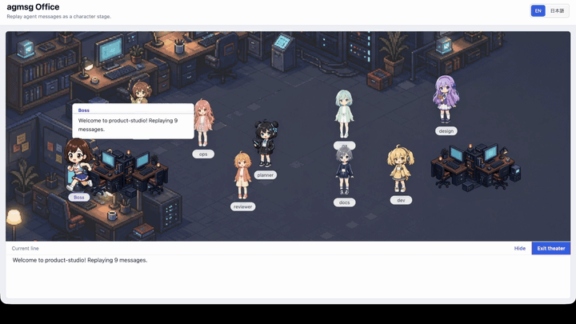

# agmsg Office

English | [日本語](README.ja.md)



**agmsg Office** replays [`agmsg`](https://github.com/fujibee/agmsg) agent-to-agent
message logs as characters talking on a stage: each agent becomes a character, and
you watch them take turns speaking. Run it locally to watch **your own** agent
conversations play out. It is a static Vite + React app that runs in the browser,
with no backend and no API keys.

## Quick start

```bash
npm install
npm run dev
```

Open the printed URL. A bundled sample is loaded for you, so press **Start** to play
it. To watch **your own data**, pick one of your local `agmsg` teams from the
**Source** dropdown and press **Start**. While the dev server (`npm run dev`) is
running, the app reads your installed `agmsg` history directly.

## How it works

agmsg Office loads an agmsg log, normalizes it, assigns each agent a character, and
replays the messages one at a time. The speaking agent shows a speech bubble while
the matching log row is highlighted, and a host character narrates the start, the
end, and any system events.

You can play three kinds of log:

- **Your local agmsg history**: the main use. While `npm run dev` is running, the
  app reads your installed `agmsg` data and lists your teams in the Source dropdown.
- **A JSON file you import**: any agmsg log exported as JSON.
- **The bundled sample**: an instant demo, in English and Japanese.

The sample and JSON import work anywhere (including a production `npm run build`).
Reading your local agmsg history needs the dev server, since that part runs a small
helper that reads your local `agmsg` data.

## Learn more

See **[docs/details.md](docs/details.md)** for the controls, the log format, the
character roster, the project structure, and how the pieces fit together.

## Credits

The Miko character (used here as the host, "Boss") is courtesy of Miko (AITuberOnAir):
https://miko.aituberonair.com/

## License

[MIT](LICENSE)
